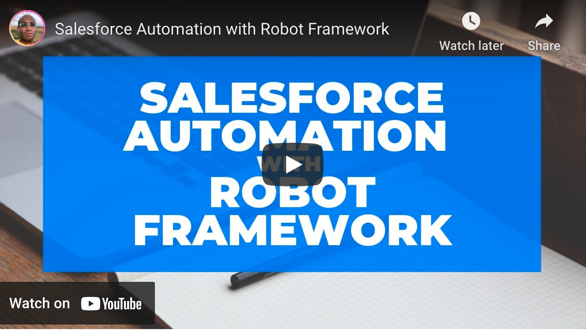
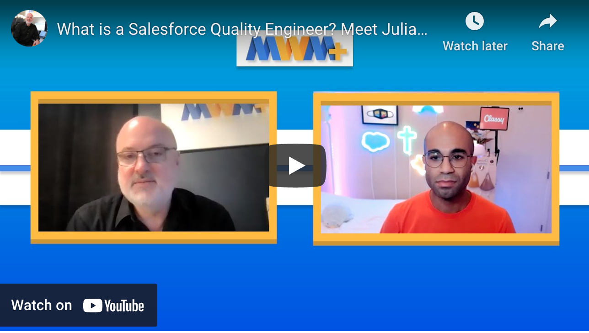

# Julian Joseph ☁️

Salesforce Quality Architect 🏛 Senior Salesforce QA (API/ISV) @ Salesforce ⚡️ Salesforce DevOps ↔️ Black ✊🏽 Gay 🌈 Christian ✝ Pizza Lover 🍕 ARFID 🦯 Accessibility ♿️ Generalized Anxiety 😔 Panic Attacks 😩 TMI?

## Featured Content

I'm a Senior Quality Engineer @ [Salesforce.com](Salesforce.com).

I enjoy [Automating Salesforce](https://www.youtube.com/watch?v=B03PY9RUUqw).

 

## A Little About Me

Flunked out of Electrical Engineering 🤭, fell in love with majoring in Asian American Studies 💜, and somehow am back in Engineering ✊🏽. I spend most of my time worrying 😱 about potential bugs 🐛 or confusing UIs 🤦🏾‍♂️ so users don't have to. Specifically, I'm a Quality Engineer at Salesforce ☁️ with experience releasing managed packages 📦 and building automated robot framework tests 🤖on CI/CD tools likes Salesforce DX and CumulusCI 🌧💰. But most importantly, I'm passionate about working on products that create social good 🌈.

## Links

- [LinkedIn](https://www.linkedin.com/in/juliandjoseph/)
- [Website](https://julianjoseph-developer-edition.na156.force.com/portfolio/s/)
- [Trailhead](https://trailblazer.me/id/julianjoseph)
- [Resume](http://bit.ly/julian2021resume)
- [Github](https://github.com/Julian88Tex)
- [Stack Exchange](https://salesforce.stackexchange.com/users/30066/julian-joseph)
